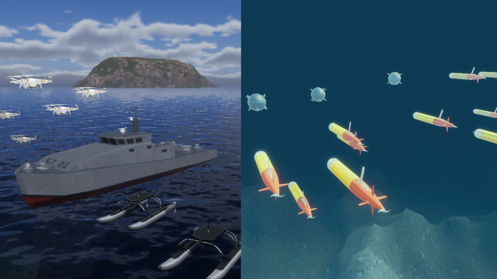

# LOTUSim

LOTUSim is a real-time maritime simulation platform for human-vehicle teaming. This platform features realistic surface, underwater, and air physics, making it an innovative cross-domain simulator in a multi-agent setting. An agent can be an aerial drone, a surface ship, or an underwater vehicle. Human operators benefit from an immersive interface to experiment with human-autonomous agent scenarios. LOTUSim can also be used to train AI algorithms by leveraging physically accurate models.

The documentation is available on [Wiki](https://github.com/naval-group/LOTUSim/wiki).

The code is open-source under [EPL-2.0](LICENSE).