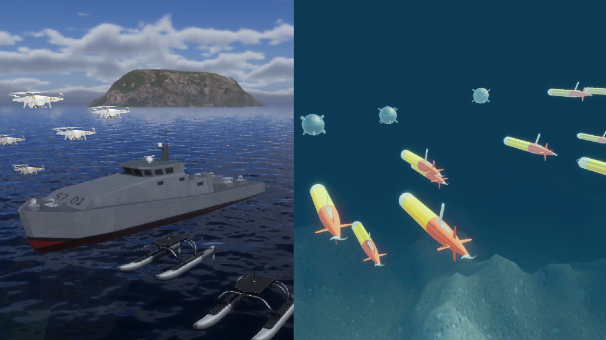

# LOTUSim



LOTUSim is a real-time maritime simulation platform for human-vehicle teaming. This platform features realistic surface, underwater, and air physics, making it an innovative cross-domain simulator in a multi-agent setting. An agent can be an aerial drone, a surface ship, or an underwater vehicle. Human operators benefit from an immersive interface to experiment with human-autonomous agent scenarios. LOTUSim can also be used to train AI algorithms by leveraging physically accurate models.

For more information, please read our [wiki here](https://github.com/naval-group/LOTUSim/wiki)

For issues or question about the simulation, please create an issue on our issue board and we will get back to you asap.

If you are interested in partnership or have questions regarding contributing to LOTUSim, please send an email to [LOTUSim support email](mailto:lotusim_support@naval-group.com) `lotusim_support@naval-group.com`.

Upcoming open-source publication under [EPL-2.0](LICENSE).

## Video
A demonstrative video of LOTUSim is available on YouTube:

[](https://www.youtube.com/watch?v=iXDz8ZqSpq4)

## Relevant Publications

If you use [LOTUSim](https://github.com/naval-group/LOTUSim) in your research, or any of the repositories directly linked to LOTUSim
- [LOTUSim-Xdyn](https://github.com/naval-group/LOTUSim-Xdyn),
- [LOTUSim-generic-scenario](https://github.com/naval-group/LOTUSim-generic-scenario),
- [LOTUSim-Unity-modules](https://github.com/naval-group/LOTUSim-Unity-modules),
- [LOTUSim-UI-frontend](https://github.com/naval-group/LOTUSim-UI-frontend),
- [LOTUSim-UI-frontend](https://github.com/naval-group/LOTUSim-UI-backend),

Please cite:

```bibtex
@inproceedings{LOTUSim26iros,
  title     = {{LOTUSim}: Multi-Domain Simulator for Marine Robotics},
  author    = {Buche, Cedric and Grosset, Juliette and Lechene, Helene and Dubromel, Marie and Havez-Bodivit, Pierig and Neo, Malcom and Prodhon, Julien},
  booktitle = {2026 IEEE/RSJ International Conference on Intelligent Robots and Systems (IROS)},
  year      = {2026},
  publisher = {IEEE}
}
```