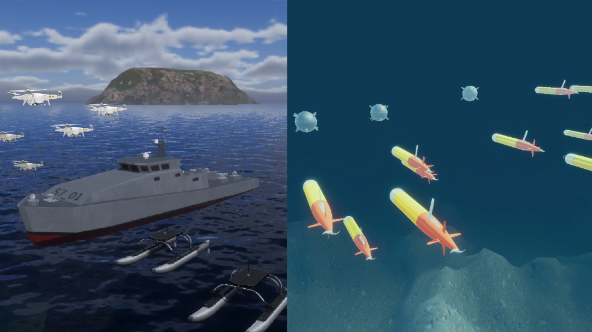

LOTUSim is a real-time, multi-domain simulation platform for maritime operations. It models realistic surface, underwater, and air physics for aerial drones, surface ships, and underwater vehicles. An immersive interface lets human operators run human-autonomous agent scenarios, and physically accurate models make LOTUSim suitable for training AI algorithms.

<br>
<p align="center">
  <strong>⚡ Jump straight to install ➜ running in under 10 minutes: <a href="https://github.com/naval-group/LOTUSim/wiki/getting-started">Getting Started</a></strong>
</p>
<br>

For full documentation, see the [wiki](https://github.com/naval-group/LOTUSim/wiki). For issues or questions, please open an issue and we will get back to you asap.

For partnerships or contributing, contact [lotusim_support@naval-group.com](mailto:lotusim_support@naval-group.com).

Upcoming open-source publication under [EPL-2.0](LICENSE).

## Video

[](https://www.youtube.com/watch?v=iXDz8ZqSpq4)

## Citation

If you use LOTUSim in your research, please cite:

```bibtex
@inproceedings{LOTUSim26iros,
  title     = {{LOTUSim}: Multi-Domain Simulator for Marine Robotics},
  author    = {Buche, Cedric and Grosset, Juliette and Lechene, Helene and Dubromel, Marie and Havez-Bodivit, Pierig and Neo, Malcom and Prodhon, Julien},
  booktitle = {2026 IEEE/RSJ International Conference on Intelligent Robots and Systems (IROS)},
  year      = {2026},
  publisher = {IEEE}
}
```

See the [Publications](https://github.com/naval-group/LOTUSim/wiki/Publications) wiki page for related repositories and papers.
